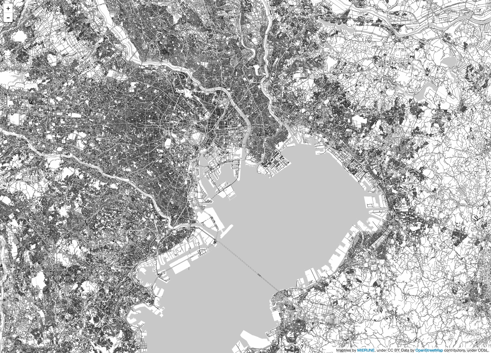

# MIERUNE-MONO
## LeafletでMIERUNE地図「MONO」を表示

### Leaflet読み込み
```
<script src="./library/leaflet-0.7.3/leaflet.js"></script>
<link href="./library/leaflet-0.7.3/leaflet.css" rel="stylesheet"/>
```

### MIERUNE地図「MONO」を設定
```
var m_mono = new L.tileLayer('https://tile.mierune.co.jp/mierune_mono/{z}/{x}/{y}.png', {
    attribution: "Maptiles by <a href='http://mierune.co.jp/' target='_blank'>MIERUNE</a>, under CC BY. Data by <a href='http://osm.org/copyright' target='_blank'>OpenStreetMap</a> contributors, under ODbL."
});
```

--- 

  

---